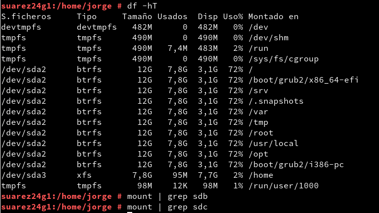

# Recuperación de datos

---

## 1. Introducción

* En esta actividad vamos a practicar el borrado de ficheros y su recuperación.
* Realizaremos la práctica de forma individual.
* Vamos a usar una MV OpenSUSE

---

## 2. Preparar el disco roto

* Añadimos un segundo disco duro `(sdb)` a la MV OpenSUSE de 10MB con el nombre *roto*.


* Iniciamos la MV y usamos la herramienta `Particionador` de Yast, para crear una partición primaria que coja todo el segundo disco y le daremos formato `ext2`.


* Creamos el directorio `/mnt/disco_roto`.

* Consultamos el UID de nuestro usuario con `id jorge` (en mi caso).
* `mount /dev/sdb1 /mnt/disco_roto -o defaults,uid=UIDNUMBER`, monta la partición en la ruta especificada estableciendo los permisos adecuado para el usuario UID.

* Tras esto comprobamos que se ha hecho bien con:
  * `df -hT`
  * `mount | grep disco_roto`


* Copiamos/Descargamos en dicha partición `(sdb1)` 3 ficheros:
  * `FILE1`: Fichero PDF
  * `FILE2`: Imagen/foto
  * `FILE3`: Canción y/o vídeo
  * Comprobamos que están con `ls /mnt/disco_roto`


* Ahora borramos `FILE1`, `FILE2` y `FILE3` usando los comandos habituales de borrado. Si borramos por el entorno gráfico, además debemos vaciar la papelera.
* Feedback de comprobación `ls /mnt/disco_roto`


* Desmontamos el disco "roto".
  * Feedback de comprobación:
    * `df -hT`
    * `mount | grep roto`
  * Si no podemos desmontar el disco, probablemente es que lo estamos usando. Con el comando `lsof | grep disco_roto`, podemos visualizar qué o quién está usando el disco.


---

## 3. Clonación alfa

Antes de recuperar los archivos del disco "roto" (sdb) vamos hacer una clonación
device-device del mismo. Al disco clonado lo llamaremos disco `alfa`. Apartir de
ahora los procesos de recuperación los haremos siempre con el disco `alfa`.


> La recuperación se debe hacer siempre en una copia y nunca en el disco original
para evitar que los procesos de recuperación afecten a la integridad del disco
"roto" (original).

* Creamos un tercer disco de igual tamaño que el disco "roto". A este disco lo
llamaremos `alfa` en VirtualBox.
* Iniciamos la MV. Deben estar los 3 discos. Feeback de comprobación: `fdisk -l`.
Además vemos que el disco B tiene una partición y el disco C no.


* Los discos "roto" y "alfa" no deben estar montados. Comprobamos con `df -hT` y `mount`.



Ahora vamos a clonar el disco "roto" en el "alfa". Ya hemos usado alguna herramienta
de clonación (Clonezilla) pero en este caso vamos a usar el comando `dd`.
Este comando hace un clonado total de disco a disco incluyendo los sectores "vacíos".
Si no clonamos los sectores "vacíos" (supuestamente vaciós) no se incluirían
los ficheros eliminados.

* Usamos el comando `dd` para clonar el disco `roto` en el disco `alfa`.
Ejemplo: `dd if=/dev/sdb of=/dev/sdc`.
* `diff /dev/sdb /dev/sdc` comando para comprobar que ambos discos son idénticos.
* `diff /dev/sdb1 /dev/sdc1` comando para comprobar que ambas particiones son idénticas.
    * Si todo va bien no muestra ningún mensaje.
    * Si va mal nos dice que son diferentes.


* `fdisk -l`,vemos que el disco C ahora si tiene una partición y el mismo formato que el B.


**A partir de ahora, todas las pruebas las haremos en el disco `alfa`.**

> En una situación de trabajo real, quitaríamos el disco "roto" de la máquina y
lo guardaríamos en sitio seguro. No es necesario hacerlo en la práctica.

---

## 4. Recuperación

### 4.1. Herramientas de recuperación

Listado de algunas herramientas de recuperación:
* *PhotoRec:* Se usa para recuperar archivos eliminados.
    * Ejemplo de cómo [recuperar archivos borrados con photorec](http://blog.desdelinux.net/recuperar-archivos-borrados-facilmente-con-photorec-desde-la-consola/).
* *TestDisk* también se puede usar para recuperar particiones.
* *Foremost.*
    * Ejemplo de uso: `foremost -v -i /dev/dispositivo -o salida-foremost`
* *Recuva*
    * [Recuva](http://www.piriform.com/recuva)
* *Scalpel.*
    * Ejemplo de uso: `scalpel /dev/dispositivo -o salida-scalpel`


### 4.2. Instalando PhotoRec

Primero tenemos que conseguir la herramienta de recuperación PhotoRec.

Instalamos el programa en nuestro sistema.
* `zypper in photorec qphotorec`, instalación de paquetes en OpenSUSE.
* Reiniciamos la MV.
* Feedback de comprobación `zypper se photorec`.

> También podríamos usar alguna distribución DVD-Live que venga con dicha herramienta, como por ejemplo:
> * Caine7 (Descargar de Leela).
> * Kali GNU/Linux (Descargar de leela).
> * Tails GNU/Linux (Descargar de la web).


### 4.3. Recuperando con PhotoRec

Vamos a iniciar el proceso de recuperación sobre la partición del disco `alfa`.
* Desmontamos el disco `alfa`.
* Abrimos una consola como root.
* Ejecutamos `qphotorec`. De esta forma iniciamos el entorno gráfico de Photorec.

Ejemplo de uso de qphotorec:

* Los archivos que se recuperen no deben escribirse en el disco `alfa`.


> La carpeta con los archivos recuperados NO deben estar en el disco `alfa` ni en el disco `roto`.

---

## 5. Recuperar ficheros de texto plano

Supongamos que no hemos podido recuperar el fichero de texto con las herramientas anteriores,
entonces vamos a probar de otra forma.

* Montamos la partición del disco alfa (sdc).
* Creamos un archivo `/mnt/disco_alfa/secreto.txt` con el siguiente contenido:

```
===============
Fichero secreto
===============

Estos son las claves de acceso de las naves imperiales.
* Abracadabra
* Ábrete sésamo
* 123456

===============
```


* Borramos el archivo de texto con `rm`.
* Desmontamos la partición.
* `cat /dev/sdc1 | more `...¿qué estamos viendo?


---
