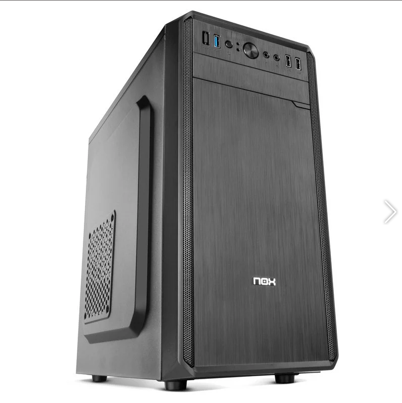
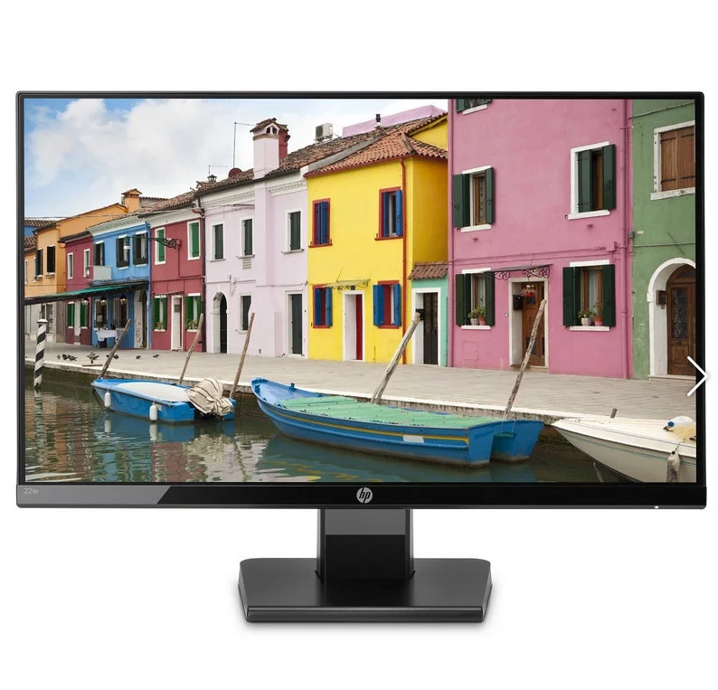
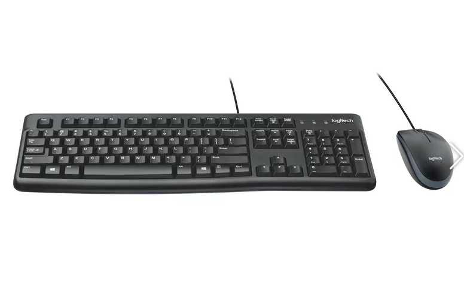
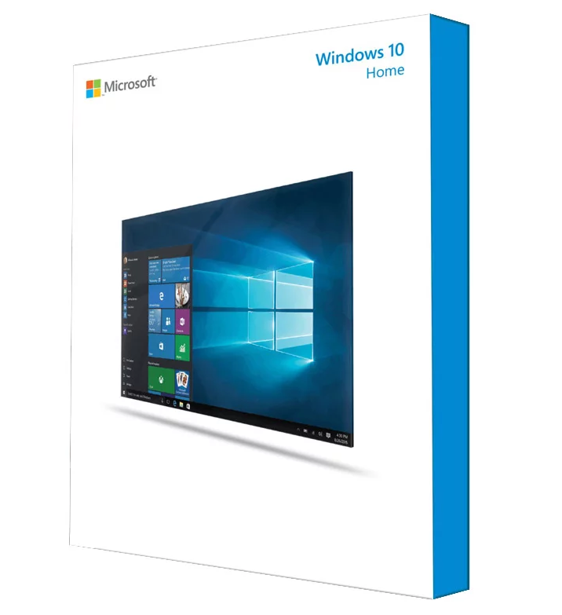

# Presupuesto para PC

---

## 1. Preparación
* Buscar presupuesto para un equipo, donde sólo podemos gastarnos hasta un máximo de *500 euros*.
* Podemos contactar con proveedores/vendedores locales directamente o remotos vía Internet/email/web.
> * Debemos tratar de encontrar un presupuesto donde se detalle al máximo posible las características hardware según hemos visto hasta hora en la asignatura. Si falta información relevante debemos contactar con el proveedor/vendedor para que nos complete los datos que nos hagan falta.

---

## 2. Información

### 2.1. Ordenador y uso

[PcCom Basic Home Intel Pentium G4560/4GB/240GB SSD](https://www.pccomponentes.com/pccom-basic-home-intel-pentium-g4560-4gb-240gb-ssd) - 232.53€

* Ordenador de sobremesa especializado para el hogar y trabajo en oficina.
* Si se pidiera hoy (14/06/19) llegaría el *17/06/19*.

### 2.2. Datos del hardware

* Monitor
  * [HP 22w 21.5" LED IPS FullHD](https://www.pccomponentes.com/hp-22w-215-led-ips-fullhd)
    - **Tamaño (diagonal):** 53.61 cm (21,5 pulgadas).
    - **Puertos:** VGA y HDMI
    - **Proporción:** 16:9
    - **Resolución:** nativa FHD (1920x1080 a 60Hz)
    - **Precio:** 89.99€

* Teclado/ratón
  - **Tipo:** [Logitech Desktop MK120](https://www.pccomponentes.com/logitech-desktop-mk120)
  - **Conectores:** Puertos USB
  - **Precio:** 15.99€

* Placa base
  - **Tipo:** Asus h110M-D
  - **Conectores:**
    1. Delanteros:
      - 2 x USB 2.0
      - 1 x USB 3.0
      - 1 x Micrófono
      - 1x Altavoces/auricular frontal
    2. Traseros:
      - 1 x PS/2 keyboard/mouse port
      - 2 x USB 2.0 ports
      - 2 x USB 3.1 Gen1 ports
      - 1 x HDMI port
      - 1 x DVI-D port
      - 1 x LPT port
      - 1 x COM port
      - 1 x LAN (RJ45) port
      - 3 x audio jacks
  - **Máximo RAM:** 1x4GB, 1 slot libre

* Tarjeta gráfica y sonido integradas.
  - Integrada

* CPU
  - Intel Pentium G4560 3.5GHz

* Memoria RAM, tipo, velocidad, etc.
  - 4GB DDR4 2133

* Disco duro
  - 240GB SSD

* Garantía: Incluye una garantía de 2 años y 30 días de devolución.
* Incluye [Microsoft Windows 10 Home 64BitsOEM](https://www.pccomponentes.com/microsoft-windows-10-home-64bits-oem) - 109€.

#### Precio final: **447.51€**
