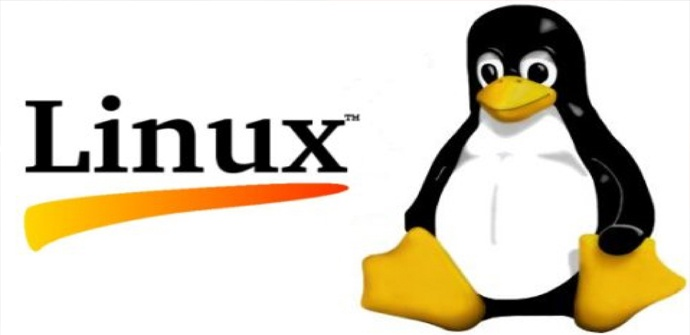
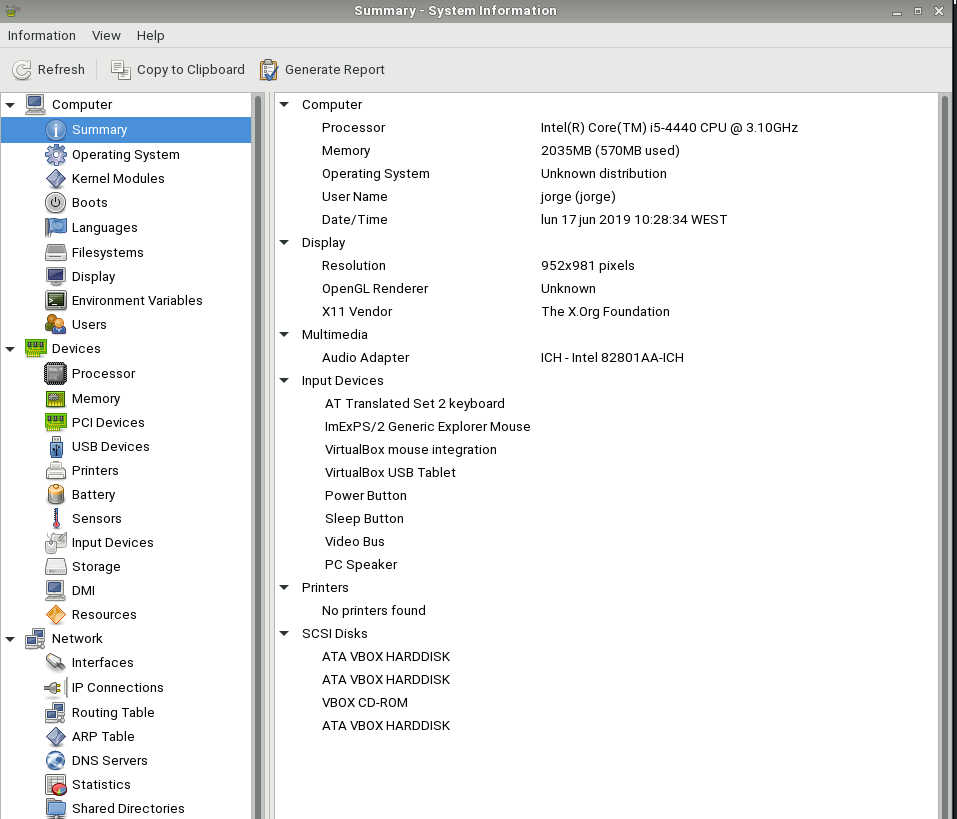
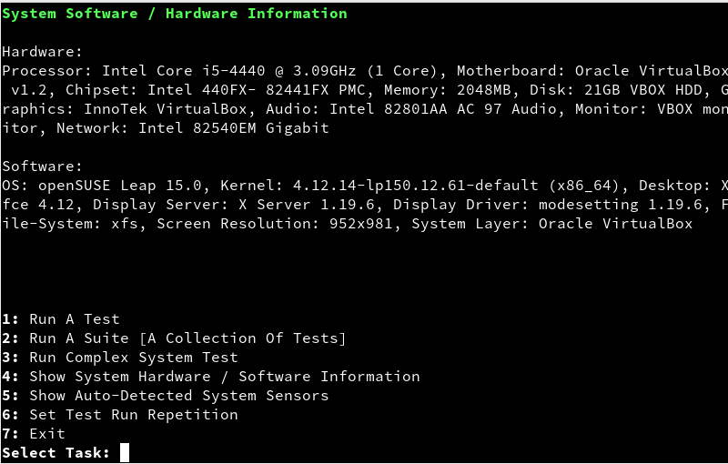
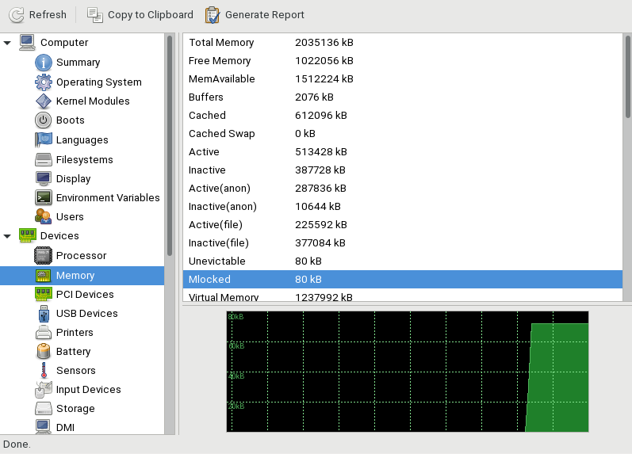
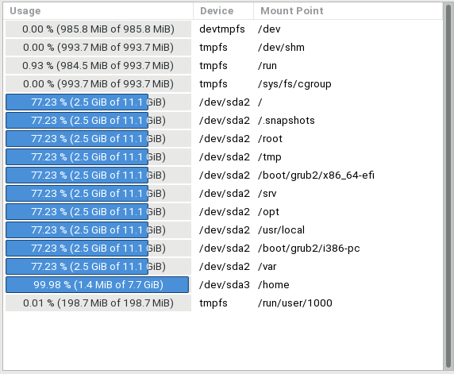

# Rendimiento de Hardware

---

## 1. Introducción

Vamos a estudiar el rendimiento de dos equipos, monitorizando el hardware, y optimizando el sistema.

## 2. Preparativos

* Usaremos 2 máquinas entre las siguientes que tengan el mismo SO:
    * Máquina real, propia de cada alumno.
    * Una máquina virtual.

---

## 3. Características de la Máquina

* Detallar las características de las dos máquinas que vamos a usar.

> NOTA:
> * Debemos asegurarnos de tener correctamente los drivers de nuestra máquina. Consultar "Administrador de dispositivos".
> * Buscar drivers para nuestro equipo [enlace](https://support.hp.com/es-es/product/hp-compaq-dx6100-microtower-pc/402168/drivers)
, para descargar los drivers de los equipos HP que estamos utilizando para la práctica en clase.
> * Podemos obtener una ISO de Hiren Boot, descargándola de Leela.

**Máquina Real (Linux)**

* CPU
  * *Intel CORE i5*
* RAM
  * *8 GB*
* Discos duros
  * *Disco1: 100 MB*
  * *Disco2: 1 TB*

**Máquina virtual (OpenSUSE)**

* CPU
  * *Intel CORE i5*
* RAM
  * *2048 MB*
* Discos duros
  * *Disco1: 20 GB*
  * *Disco2: 10 MB*
  * *Disco3: 10 MB*

---

## 4. Monitorización

Ejecutar las siguientes herramientas:

| Categoría | Herramienta | GNU/Linux |
| --------- | ----------- |  --------- |
| Inventario | Realizar inventariado del equipo | Hardinfo |
| CPU | Rendimiento de la CPU | Phoronix-test-suite |
| RAM | Comprobar la RAM | Memtest86+ |
| Discos | Rendimiento de los discos duros | SmartMonTools: monitorización de los discos usando el sistema S.M.A.R.T. de los propios discos |

**Inventario - Hardinfo**

**CPU - Phoronix-test-suite**

**RAM**

**Discos**

> Otros programas que pueden ser de utilidad:
>
> | Categoría | Programa | Descripción |
> | --------- | -------- | ----------- |
> | Todo      | Hiren | CD con muchas herramientas |
> | Todo      | GNU Krell Monitors | Herramienta gráfica para monitorizar distintos parámetros del equipo (depende de “lmsensors” y “hdd-temp”, entre otros) |
> | Todo | PSensor | Herramienta gráfica para monitorizar la temperatura del hardware (CPU, GPU, placa base, discos duros, velocidad de rotación de los ventiladores,…). Es posible monitorizar una máquina remota (psensorserver). |
> | CPU | CPUCool | HW Monitor |
> | CPU | CPUBurn | pruebas de estrés de la CPU (PELIGROSO; úsalo bajo tu propia responsabilidad; vigilar la temperatura del micro cuando se hagan las pruebas). Para microprocesadores Intel(burnP6). Para micros AMD (burnK7) |
> | Discos | GParted | Herramienta de gestión de particiones |

---
