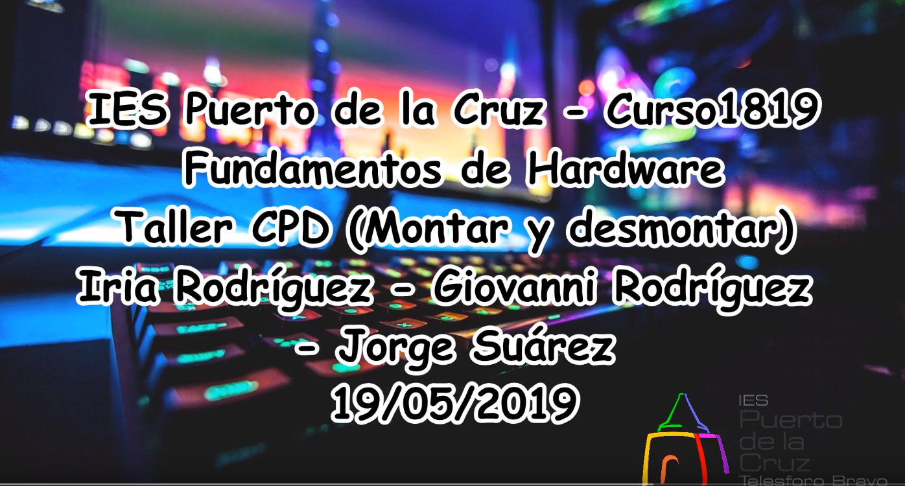

# CPD desmontar y montar

---

## 1. Recoger

* Recogemos un servidor asignado por el profesor. Debe tener una identificación pegada. En nuestro caso, utilizamos el `NIBBLER`
* Recogemos la ficha del equipo `NIBBLER`
* El Servidor es un `Dell Poweredge 1400SC`
* Para tener una descripción más completa buscamos la Guía del Usuario del servidor.
  * [Guía de usuario del servidor Poweredge 1400SC](https://downloads.dell.com/manuals/all-products/esuprt_ser_stor_net/esuprt_poweredge/poweredge-1400sc_user%27s%20guide_es-mx.pdf)

* Aparte de ese servidor utilizamos un servidor `Blade`.

---

## 2. Desmontar

---

## 3. Montar

---

## 4. Vídeo demostración

Aquí les dejo el vídeo en el que explicamos los pasos seguidos, características del servidor `Dell` y `Blade` y el montaje y desmontaje de los mismos.

> Pinchar en la siguiente imagen y les llevará directamente al vídeo.

 - FUW")
