# Almacenamiento en la nube

---

## 1. Nube ajena

Practicaremos el almacenamiento usando la nube de un proveedor externo.

Pasos a realizar:
* Elegir alguna de las siguientes herramientas:
  * `DropBox`
  * `Google Drive`
  * `OneDrive`
  * `Mega`

Yo voy a utilizar `Google Drive`

* Realizar la instalación y configuración de la herramienta elegida sobre:
  * `Windows`
  * `GNU/Linux`
  * `Android`
* Mostraremos su uso mediante ejemplos.

A continuaciónles mostraré un vídeo de unos sencillos pasos de como subir y crear archivos facilmente en la nube.

---

## 2. Nube propia con NextCloud Server en OpenSUSE Leap

Vamos a utilizar un servicio de almacenamiento libre, asi que utilizaremos **NextCloud**, aunque tambien pueden utilizar **ownCloud**.

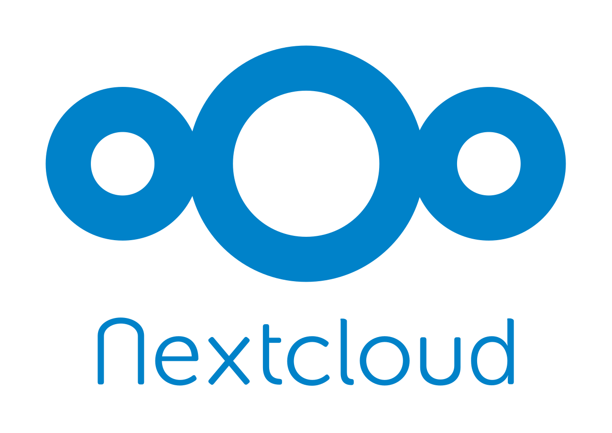

### 2.1. Servidor Web Apache: Instalación y configuración

Comando | Explicación
------- | -----------
`zypper in apache2` | Instalar Apache2.
`systemctl start apache2` | Iniciar Apache2.
`systemctl enable apache2` | Inicio automático del servicio apache después de reiniciar.

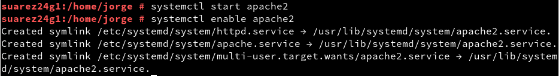

* Abrimos el acceso Web desde el cortafuegos
  * Vamos a `Yast` -> `Cortafuegos`
  * Añadir en `Servicios Autorizados` de la `Zona externa` a: `apache2`, `http`, `https`.

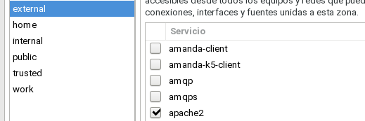

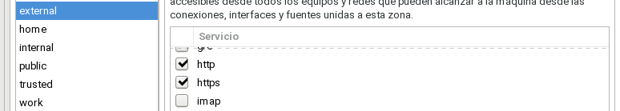

### 2.2. PHP: Instalación y configuración

Comando | Explicación
------- | -----------
`zypper in php7 php7-mysql apache2-mod_php7` | Instalar PHP7.
`a2enmod php7` | Habilitar mod-php

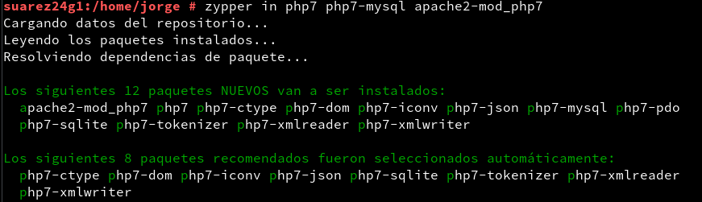

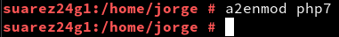

### 2.3. Database MariaDB

Instalación:

Comando | Explicación
------- | -----------
`zypper in mariadb mariadb-tools` | Instalar MariaDB.
`systemctl start mariadb` | Iniciar el servicio de MariaDB.
`systemctl enable apache2` | Inicio automático del servidor MariaDB en cada inicio.
`mysql_secure_installation` | Configurar el servicio MariaDB con seguridad mejorada.

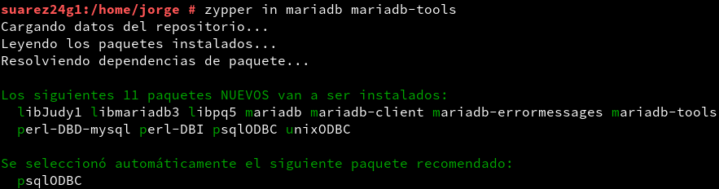

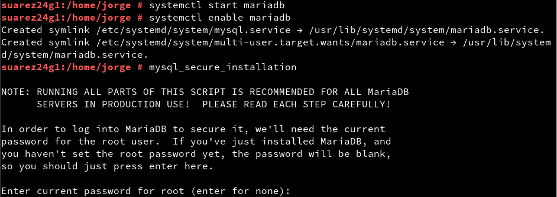

Configuración para NextCloud:

> Incluir exactamente las líneas de comandos posteriores, con el punto y coma en las que lo tengan.

1. `mysql -u root -p`

2. `create database nextcloud;` Crear la base de datos de NextCloud.

3. `create user nextclouduser@localhost identified by 'some-password-here';` Crear el nuevo usuario de NextCloud.

4. `grant all privileges on nextcloud.* to nextclouduser@localhost identified by 'some-password-here';`. Conceder los privilegios necesarios sobre el usuario de NextCloud.

> Sustituir 'some-password-here' por la contraseña deseada.

5. `exit;` Salir de la configuración de la base de datos.

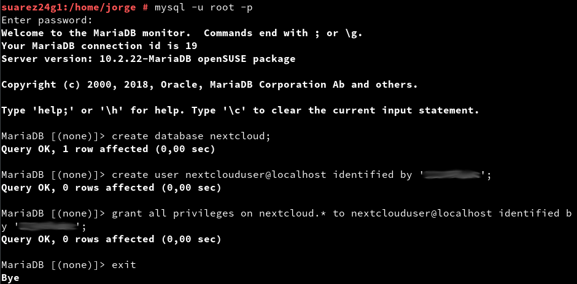

### 2.4. NextCloud

Instalación:

Comando | Explicación
------- | -----------
`zypper in nextcloud` | Instalar NextCloud.

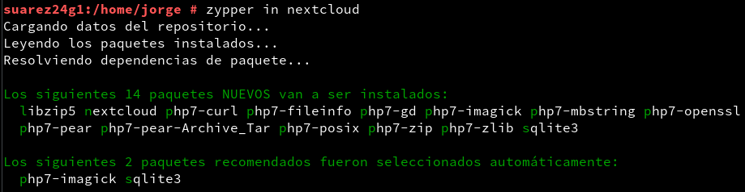

Configuración:

1. Navegamos por el portal web de NextCloud. Abrimos http://localhost/nextcloud para instalar nuestra instancia.

2. Creamos un usuario administrador con el nombre y contraseña de libre elección.

3. Seleccionar el Almacenamiento y Base de Datos desplegable.

4. La carpeta de datos dejamos la ruta predeterminada.

5. Debajo de Configurar Base de Datos, selecciona,os MySQL/MariaDB

6. Introducimos el usuario de MariaDB para NextCloud:
    - Database User: **nextclouduser**
    - Database User Password: (para nextclouduser)
    - Database name: **nextcloud**
    - Hostname: **localhost**

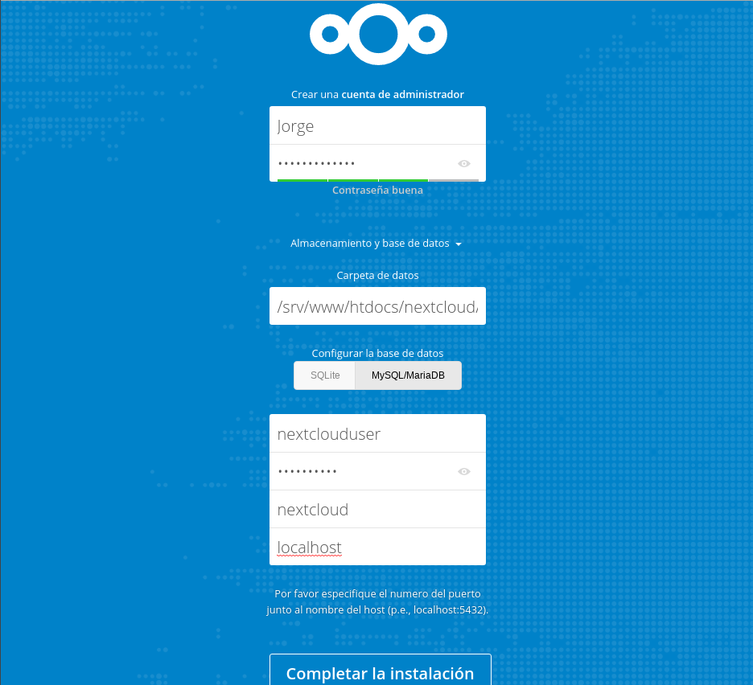

---

## 3. Comprobar vía web

* Para prevenir posibles problemas, haremos una copia de seguridad del fichero de configuración `/srv/www/htdocs/nextcloud/config/config.php`.

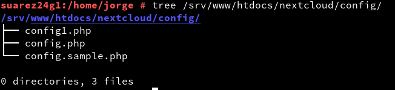

* Para permitir el acceso desde otros equipos, tenemos que añadir la IP del servidor a las opciones `trusted_domains` dentro del fichero de configuración `/srv/www/htdocs/nextcloud/config/config.php`.

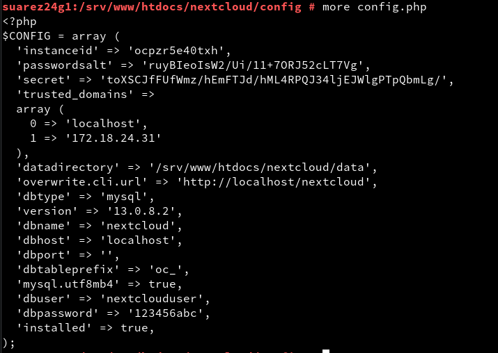

* Abrimos un navegador URL: `172.18.24.31/nextcloud`. Ahora debe funcionar el acceso usando la IP tanto desde el propio servidor como desde otra máquina.

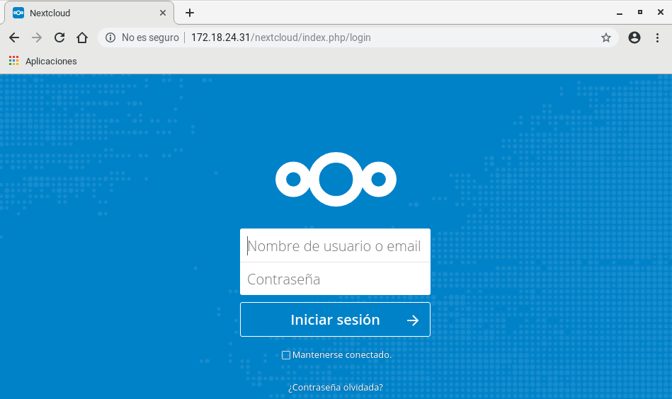

* Abrimos un navegador web, y ponemos en el URL: `http://localhost/nextcloud`.
* Usamos nuestro usuario/clave administrador.
* Creamos un usuario normal `jorge24`.
* Subiremos algunos archivos en el servidor con el usuario anterior.

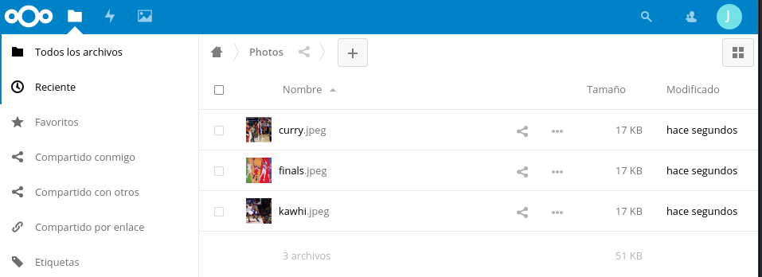

* Creamos un usuario normal `iria12`.
* Le decimos al compañero que suba algunos archivos al servidor con el usuario anterior.

---

## 4. NextCloud Desktop Client

Iniciaremos una MV con Windows7:
  * Instalar el software cliente de NextCloud.
    * Usar URL: `http://172.18.24.31/nextcloud`
  * Comprobar como se mantienen sincronizados los archivos entre las máquinas.

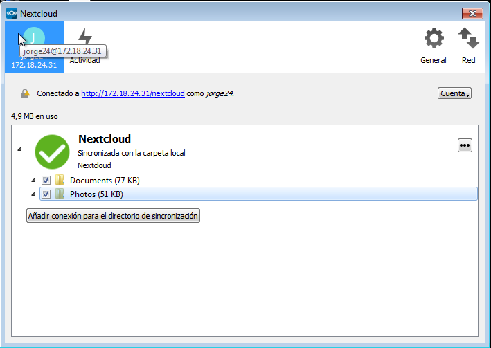
