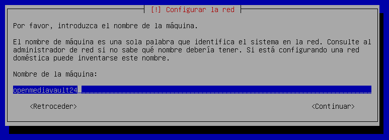
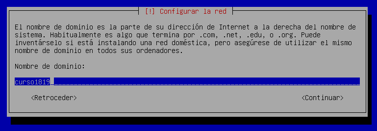
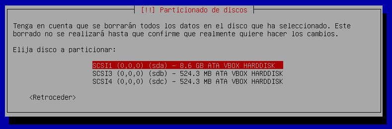
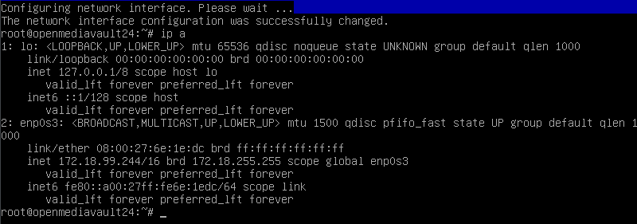

# Almacenamiento NAS con Open Media Vault

---

## 1. Crear la MV

* Creamos una MV con las siguientes especificaciones:

<table>
  <tr>
    <th colspan="3">MV Debian 64 bits</th>
  </tr>
    <th>Discos</th>
    <th>Tamaño</th>
    <th>Función</th>
  <tr>
    <td>Disco1 (sda)</td>
    <td>8 GB</td>
    <td>Sistema Operativo</td>
  </tr>
  <tr>
    <td>Disco2 (sdb)</td>
    <td>500 MB</td>
    <td>Almacenamiento</td>
  </tr>
  <tr>
    <td>Disco3 (sdc)</td>
    <td>500 MB</td>
    <td>Almacenamiento</td>
  </tr>
</table>

* Red en modo puente

---

## 2. Instalar Open Media Vault

* Nombre de máquina: `openmediavault24`

* Dominio: `curso1819`

* Elegimos el disco1 `(sda)` para instalar el sistema operativo.

* Al terminar la instalación se nos muestra la IP del NAS.
  * Apuntamos la IP del NAS.
  > En mi caso la IP es `172.18.99.244`
  * Usuario/Clave del panel Web: `admin/openmediavault`
* Entramos con el usuario `root`.
* Ejecutamos el comando `omv-firstaid`.
  * Configuramos la IP estática para el NAS.
  * Cambiamos clave de acceso al panel Web.

---

## 3. Crear almacenamiento RAID

* Desde otra máquina abrimos navegador con URL `172.1`.
* Poner usuario/clave del panel Web.
* Vamos a `Almacenamiento` -> `Gestión de Raid`.
  * Creamos un `espejo` con el nombre `nasraid1`, usando los discos `sdb` y `sdc`.

Creamos un nuevo sistema de archivos:

Dispositivo | Nombre    | Formato | Montaje
----------- | --------- | ------- | -------
nasraid1    | nasdatos  | ext4    | /dev/md0

---

## 4. Crear recurso compartido

---

## 5. Crear usuario

---

## 6. Activar el servicio

---

## 7. Comprobar

