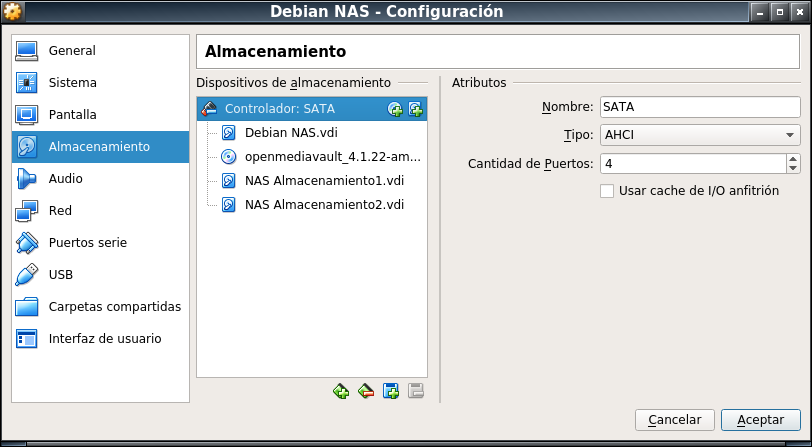

# Almacenamiento NAS con Open Media Vault

---

## 1.

* Creamos una MV con las siguientes especificaciones:

<table>
  <tr>
    <th colspan="3">MV Debian 64 bits</th>
  </tr>
    <th>Discos</th>
    <th>Tamaño</th>
    <th>Función</th>
  <tr>
    <td>Disco1</td>
    <td>8 GB</td>
    <td>Sistema Operativo</td>
  </tr>
  <tr>
    <td>Disco2</td>
    <td>500 MB</td>
    <td>Almacenamiento</td>
  </tr>
  <tr>
    <td>Disco3</td>
    <td>500 MB</td>
    <td>Almacenamiento</td>
  </tr>
</table>

* Red en modo puente

---

## 2.

---

## 3.

---

## 4.

---

## 5.

---

## 6.

---

## 7.

