# Almacenamiento NAS con Open Media Vault

---

## 1. Crear la MV

* Creamos una MV con las siguientes especificaciones:

<table>
  <tr>
    <th colspan="3">MV Debian 64 bits</th>
  </tr>
    <th>Discos</th>
    <th>Tamaño</th>
    <th>Función</th>
  <tr>
    <td>Disco1 (sda)</td>
    <td>8 GB</td>
    <td>Sistema Operativo</td>
  </tr>
  <tr>
    <td>Disco2 (sdb)</td>
    <td>500 MB</td>
    <td>Almacenamiento</td>
  </tr>
  <tr>
    <td>Disco3 (sdc)</td>
    <td>500 MB</td>
    <td>Almacenamiento</td>
  </tr>
</table>

* Red en modo puente

---

## 2. Instalar Open Media Vault

* Nombre de máquina: `openmediavault24`

* Dominio: `curso1819`

* Elegimos el disco1 `(sda)` para instalar el sistema operativo.

* Al terminar la instalación se nos muestra la IP del NAS.
  * Apuntamos la IP del NAS.
  > En mi caso la IP es `172.18.99.244`
  * Usuario/Clave del panel Web: `admin/openmediavault`
* Entramos con el usuario `root`.
* Ejecutamos el comando `omv-firstaid`.
  * Configuramos la IP estática para el NAS.
  * Cambiamos clave de acceso al panel Web.

---

## 3. Crear almacenamiento RAID

* Desde otra máquina abrimos navegador con URL `172.18.99.244`.
* Poner usuario/clave del panel Web.

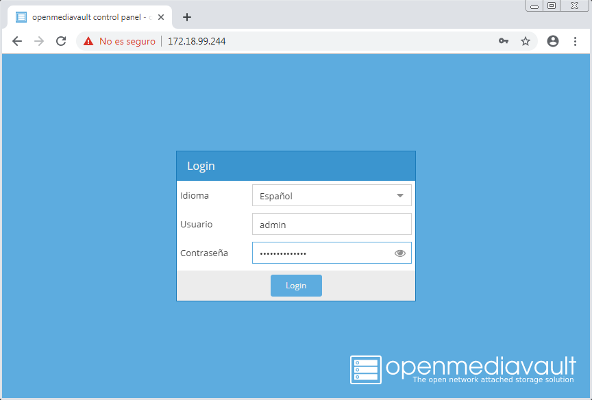

* Vamos a `Almacenamiento` -> `Gestión de Raid`.
  * Creamos un `espejo` con el nombre `nasraid1`, usando los discos `sdb` y `sdc`.

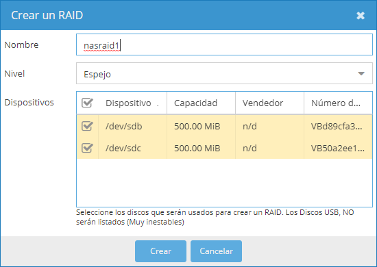

* Creamos un nuevo sistema de archivos:

Dispositivo | Nombre    | Formato | Montaje
----------- | --------- | ------- | -------
nasraid1    | nasdatos  | ext4    | /dev/md0

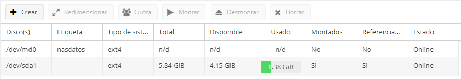

---

## 4. Crear recurso compartido

* Vamos a `Servicios` -> `SMB/CIFS` -> `Compartidos`
* Añadimos:
  * Habilitar `SI`.
  * Carpeta compartida -> `Crear +`.
    * Nombre: `public`.
    * Dispositivo: `nasraid1`.
    * Ruta: `public/`.
    * Con permisos de Lectura/escritura para los usuarios.
  * Público `NO`.
  * Sólo lectura `NO`.

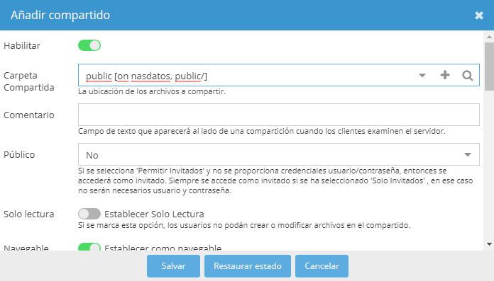

---

## 5. Crear usuario

* Vamos a `Permisos de Acceso` -> `Usuario`.
  * Creamos un nuevo usuario `jorge24`.
  * Comprobamos que pertenece al grupo `users`.

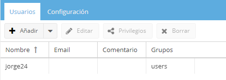

* Vamos a `Permisos de Acceso` -> `Carpetas compartidas`.
  * Damos permisos al usuario `jorge24` de lectura/escritura sobre la carpeta compartida.

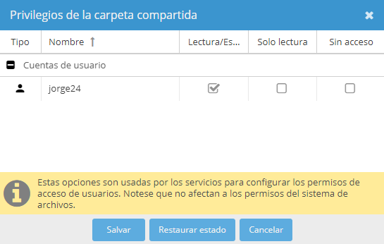

---

## 6. Activar el servicio

* Vamos a `Servicios` -> `SMB/CIFS` -> `Configuración` -> `Opciones generales` -> `Habilitar`.
* Vamos a `Diagnósticos` -> `Sevicios` para verificar que el servicio `SMB/CIFS` está habilitado y en ejecución.
* Si el servicio no está en ejecución, podemos reiniciar el equipo o probar con el comando `systemctl start smbd`.

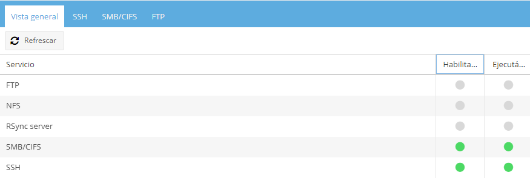

---

## 7. Comprobar

**MV Windows7**

* Comprobar el acceso al recurso compartido.
* Podemos encontrar la MV más rápido poniendo `\172.18.99.244` en la búsqueda de red.

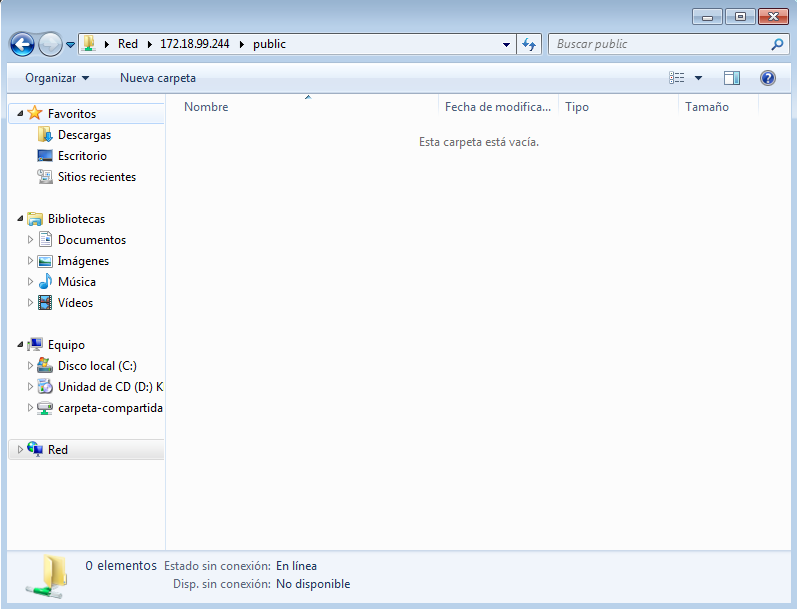

* `net use` para comprobar sesiones de red abiertas.
* `netstat -nt` para comprobar que hay una conexión establecida con el servidor.

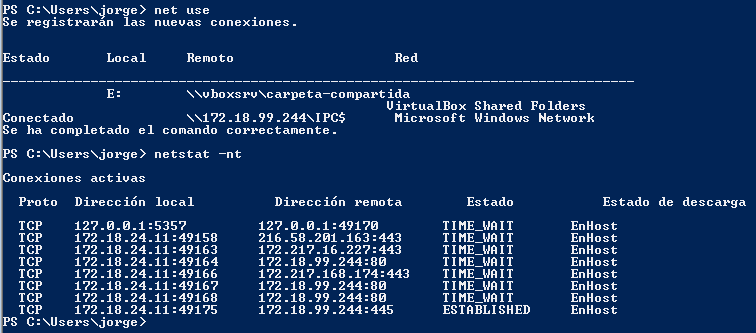

**MV GNU/Linux**

* Comprobamos el acceso al recurso compartido.
  * Abrimos explorador de archivos -> `CTRL+L`
  * Poner URL `smb://172.18.99.244`

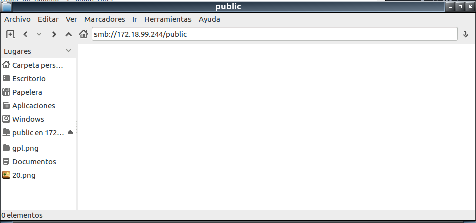

* `netstat -nt` para comprobar que hay una conexión establecida con el servidor.

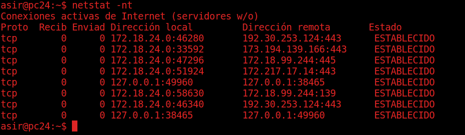
