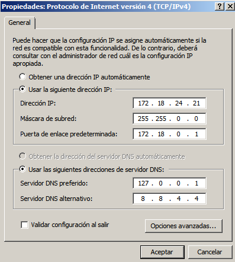
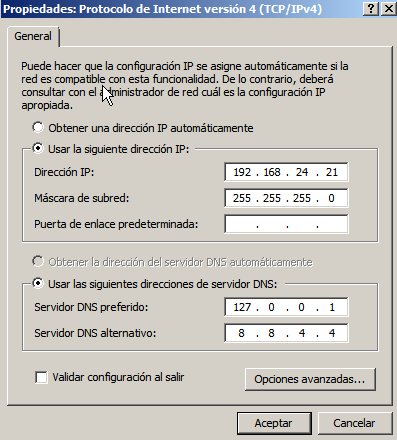

# iSCSI en Windows Server 2008

Vamos a montar un almacenamiento iSCSI con Windows Server 2012 (64 bits).

> *El siguiente texto está copiado de un enlace de internet*

```
Para los que no estén familiarizados con iSCSI,
digamos que es una manera de “encapsular” comandos SCSI en paquetes IP.
De esta manera podemos acceder a sistemas de almacenamiento externos
usando una red IP en lugar de los tradicionales buses SCSI
o los canales de fibra.
Es decir, una buena forma de montarnos una SAN.

La solución consta de al menos dos componentes.
Un iSCSI Initiator y un Target.

**Initiator**
Es lo que utilizamos en el equipo que va a acceder a esos volúmenes.

**Target**
Es lo que nos permitirá crear el sistema de almacenamiento compartido, y el que
permitirá el acceso a las LUNs que se hayan creado a cada cliente específico.

Generalmente esta tecnología está ya incluida en el propio hardware de los
servidores y de los sistemas SAN, que ofrecen este tipo de conectividad
a través de dispositivos multifunción.

Sin embargo esto no excluye que un iniciador software se pueda conectar
a un Target hardware o viceversa.

El iSCSI initiator puede descargarse gratuitamente, para Windows XP y
Windows server 2003. En Windows Vista y Windows Server 2008 viene ya incluido
por defecto. Los iniciadores software son muy útiles en entornos virtualizados,
ya que permiten a las máquinas virtuales el acceso a sistemas de tipo SAN
mediante tarjetas de red, generalmente dedicadas en el host y en el guest.
```

---

## 1. Preparativos

Necesitamos 2 MV's con Windows Server, en mi caso utilizaré `Windows Server 2008`.

**Máquina Virtual Initiator**

* La MV Initiator será la que consumirá el espacio de almacenamiento.

<table>
  <tr>
    <th>MV1</th>
    <th colspan="2">Initiator</th>
  </tr>
  <tr>
    <th>Interfaz de Red</th>
    <th>Red Adaptador puente</th>
    <th>Red interna</th>
  </tr>
  <tr>
     <th>Nombre</th>
     <td>enp3s0</td>
     <td>san</td>
  </tr>
  <tr>
    <th>IP</th>
    <td>172.18.24.21</td>
    <td>192.168.24.21</td>
  </tr>
  <tr>
    <th>Gateway</th>
    <td>172.18.0.1</td>
    <td>NO</td>
  </tr>
</table>

> **Interfaz de Red Adaptador puente**




> **Interfaz de Red Interna**




**Máquina Virtual Target**

* La MV Target es la encargada de ofrecer espacio de almacenamiento.

<table>
  <tr>
    <th>MV2</th>
    <th>Target</th>
  </tr>
  <tr>
    <th>Interfaz de Red</th>
    <th>Red interna</th>
  </tr>
  <tr>
     <th>Nombre</th>
     <td>san</td>
  </tr>
  <tr>
    <th>IP</th>
    <td>192.168.24.22</td>
  </tr>
  <tr>
    <th>Gateway</th>
    <td>192.168.24.21</td>
  </tr>
  <tr>
    <th>Segundo Disco</th>
    <td>800 MB</td>
  </tr>
</table>

> **Interfaz de Red Interna**


> **IMPORTANTE**
> * Las IP's las pondremos todas estáticas.
> * Las IP's de la red interna estarán en el rango 192.168.24.NN/24.

---

## 2. Initiator: Configurar IQN

Las máquinas que intervienen en iSCSI usan un identificador llamado IQN. Al instalar el sistema operativo se pone un valor por defecto para el IQN. Nosotros vamos a personalizar estos valores.

Vamos a cambiar el identificador IQN de nuestro iniciador.

* `Herramientas` -> `iSCSI Iniciador` -> `Configurar` -> `Identificador`
  * Ponemos como IQN lo siguiente: `iqn.2019-05.initiator24w`.


---

## 3. Target: Instalación

### 3.1. Instalar el target

* Hay que descargar el software `iSCI Target` para instalar en Windows Server (Target).
  * Descargamos iSCI Target 3.3 o superior desde la web de Microsoft.
  * Instalamos el software (version de 64 bits).
    * `C:\iSCI_target\x64\instalar_target.msi`.


### 3.2. Cambiar el identificar IQN

Vamos a cambiar el identificador IQN de nuestro iniciador.

* `Herramientas` -> `iSCSI Iniciador` -> `Configuración` -> `Cambiar`
  * Ponemos como IQN lo siguiente: `iqn.2019-06.target24w`.


---

## 4. Target: Crear destino y dispositivo

### 4.1. Crear un destino

Los destinos (según las definiciones del protocolo iSCSI) es una definición de un espacio de almacenamiento concreto.

* Vamos a `Herramientas administrativas` -> `Microsoft iSCSI Software Target` -> Click derecho en `Destinos iSCSI` -> `Crear destino iSCSI`.
* Creamos un nuevo destino iSCSI:
  * Nombre: `alumno24destino01`.
  * Descripción: `Destino 1 - Jorge 07-06-19`

  

  * Nombre del IQN del iniciador o también en avanzado podremos poner la dirección IP del `Initiator`.
    > El identificador IQN del initiator es la forma de identificar el equipo que tendrá permitido el uso del almacenamiento que estamos creando.


> **¡OJO!** El iniciador tiene 2 IP's, pero se comunica con el target usando el interfaz de red de la red interna.

### 4.2. Crear un dispositivo

Ahora vamos a añadir discos al destino que hemos creado anteriormente.
* Creamos disco virtual para el destino iSCSI en `E:\jorge24disco01.vhd` de tamaño 600 MB.
* Asociamos este dispositivo con el destino 1.


---

## 5. Iniciador: acceder al almacenamiento

### 5.1. Configurar Iniciador

* Vamos al iniciador.
> (El software Iniciador ya viene preinstalado).

* Solo tenemos que configurarlo para conectar con el target.
* `Destino` -> `IP del target`.


* Vamos a `Administrador del Servidor` -> `Almacenamiento` -> `Administrador de Discos`.
* Ponemos el disco en línea haciendo click derecho en el disco.

Ya tenemos el nuevo almacenamiento disponible en el `Initiator`.


### 5.2. Consumir almacenamiento

* Desde el `Initiator`, montamos el nuevo almacenamiento (Letras de unidad, `F` o `G`, por ejemplo).
* Guardar varios ficheros en dichas unidades, de modo que la información que se guarde en ella se almacenará en el Target remoto.


